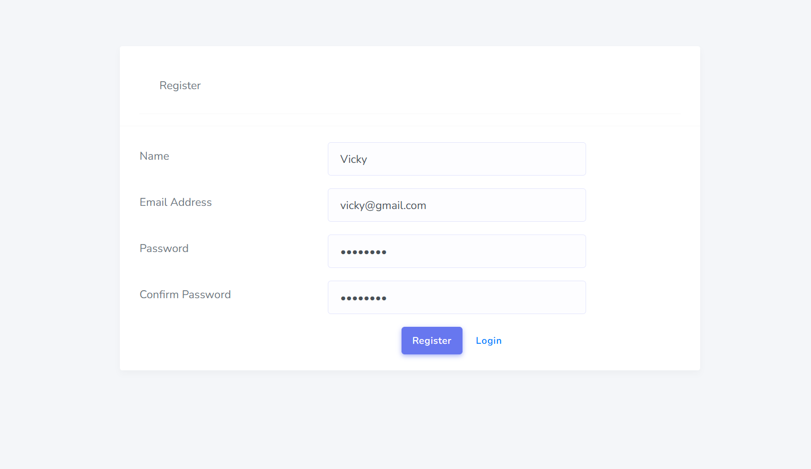
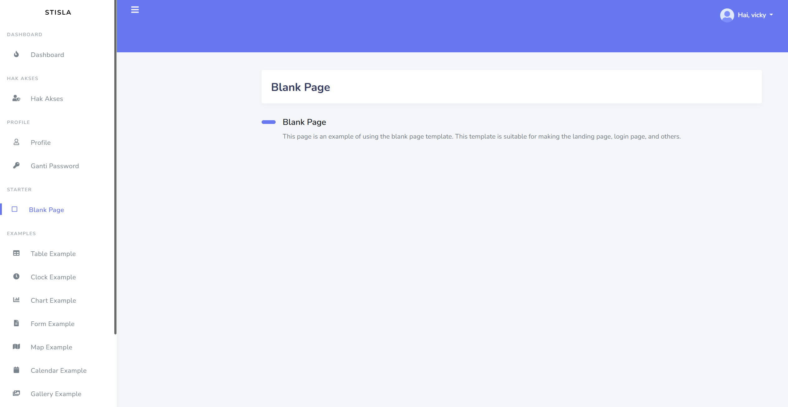

# laravel 12 with Stisla Template

Welcome to the repository for laravel 12 integrated with Stisla Bootstrap 5 template!

## Overview
This repository contains a laravel 12 template that comes pre-configured with authentication from Breeze and utilizes the Stisla Bootstrap 5 template for the UI. It includes various features to help you quickly set up a robust web application.

## Features
- laravel 12
- Stisla Bootstrap 5 Template
- Authentication with Laravel Breeze
- User Profile Management
- Responsive Design
- Pre-configured Dashboard
- Example Pages (Register, Login, Dashboard, Blank Page, Edit User Profile)

## Installation Guide

### Prerequisites
- PHP >= 8.2
- Composer
- Node.js
- npm

### Installation Steps
1. Clone the repository:
    ```bash
    git clone https://github.com/vickymaulana/laravel11-stisla.git
    ```

2. Navigate into the project directory:
    ```bash
    cd laravel11-stisla
    ```

3. Install PHP dependencies:
    ```bash
    composer install
    ```

4. Install JavaScript dependencies:
    ```bash
    npm install && npm run dev
    ```

5. Copy the `.env.example` file and rename it to `.env`:
    ```bash
    cp .env.example .env
    ```

6. Generate application key:
    ```bash
    php artisan key:generate
    ```

7. Run database migrations:
    ```bash
    php artisan migrate
    ```

8. Start the development server:
    ```bash
    php artisan serve
    ```

### Register a New User
To register a new user, follow these steps:

1. Visit the registration page at `http://localhost:8000/register`.
2. Fill in the required fields: Name, Email, Password, and Confirm Password.
3. Click the "Register" button to create a new account.

After registration, you will be redirected to the dashboard.

If you encounter any issues during registration, please check the browser console for errors or refer to the Laravel logs for more details.

## Contributors
- **Vicky Maulana** - [GitHub](https://github.com/vickymaulana)

### Special Thanks
I extend my gratitude to all the interns at LLDIKTI 2 Division of Information System Development for their contributions and support.

- [Ahmad Dimas Aldian Al-furqon](https://github.com/anqois)
- [Abdillah Khalid](https://github.com/KhalidUnsri)
- [Haikal Tirta Albanna](https://github.com/HaikalAlbanna)
- [Meta Berliana](https://github.com/Metabrln)
- [Imelda Triadmajaya](https://github.com/imeldatriajaya)
- [Hilwa Izzatinnafisah](https://github.com/ksnwaa)
- [Triyana Sugiyarti](https://github.com/TriyanaSgi)
- [Adelia Isni Hendrawan Putri](https://github.com/lilisky07)
- [Siti Nur Azizah](https://github.com/sukasukajija)
- [M. Husaini Hasyim](https://github.com/son-alone)
- [Andre Satriawan](https://github.com/andresa11satriawan)
- [Lathifah Putri Aresti](https://github.com/lathifahputri)
- [Sisca Amelia](https://github.com/siscaamelia)
- [M. Denny Tri Lisandi](https://github.com/Koutsura)

Feel free to explore their repositories as well.

---

If you encounter any issues or have suggestions for improvements, please feel free to open an issue or submit a pull request. Thank you for your interest and support!

## Screenshots

### Register Page


### Login Page


### Dashboard Page


### Blank Page


### Edit User Profile Page


## Database Refresh and Seeding

To refresh the database and run all seeders, use the following command:

```bash
php artisan app:refresh-database
```

This will:
1. Drop all tables in the database
2. Run all migrations
3. Run all seeders

If you want to skip the confirmation prompt, use the `--force` option:

```bash
php artisan app:refresh-database --force
```

## Seeders

The following seeders are available:

1. **UserSeeder**: Creates sample users with different roles (admin, hr, user)
2. **EmployeeSeeder**: Creates sample employee records
3. **EducationSeeder**: Creates sample education records for each employee
4. **WorkExperienceSeeder**: Creates sample work experience records for each employee

## Recent Changes

### Combined Fields

The following fields have been combined into a single field:
- `golongan`, `jabatan`, and `unit_kerja` have been combined into the `golongan` field

The format for the combined field is:
```
[Golongan] - [Jabatan] - [Unit Kerja]
```

Example: `III/a - Kepala Seksi - Puskesmas Kota`

### Email Field

The `email` field in the `employees` table has been made nullable.

## Login Credentials

You can log in with the following credentials:

### Admin User
- NIP: admin123
- Password: password

### HR User
- NIP: 198505052018011002 (Budi Santoso)
- Password: password

### Regular User
- NIP: 198001012010011001 (John Doe)
- Password: password
- NIP: 199005202015022002 (Jane Smith)
- Password: password
- NIP: 201001012022011001 (Ahmad Rizki)
- Password: password
- NIP: 198703152020032001 (Siti Rahayu)
- Password: password
